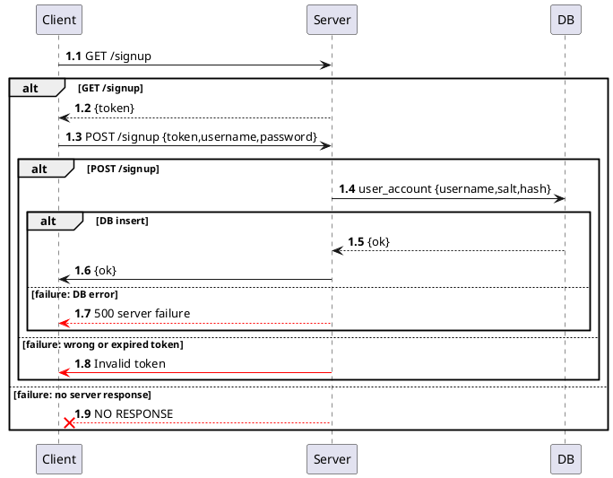
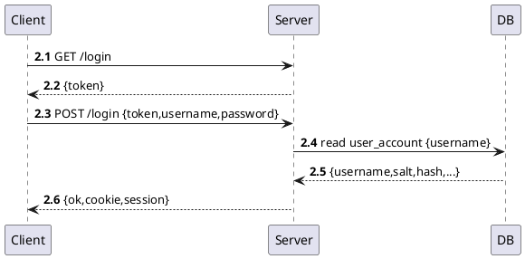

# Authentication Architecture

Signup

```plantuml
@startuml

autonumber 1.1
Client -> Server: GET /signup

alt GET /signup

    Server --> Client: {token}
    Client -> Server: POST /signup {token,username,password}

    alt POST /signup
        Server -> DB: user_account {username,salt,hash}
        alt DB insert
            DB --> Server: {ok}
            Server -> Client: {ok}
        else failure: DB error
            Server -[#red]-> Client: 500 server failure
        end
            
    else failure: wrong or expired token
        Server -[#red]> Client: Invalid token
    end
else failure: no server response

    Server -[#red]->x Client: NO RESPONSE

end
@enduml
```

Login

```plantuml
@startuml


autonumber 2.1
Client -> Server: GET /login
Server --> Client: {token}

Client -> Server: POST /login {token,username,password}
Server -> DB: read user_account {username}
DB --> Server: {username,salt,hash,...}
Server --> Client: {ok,cookie,session}

@enduml

```
