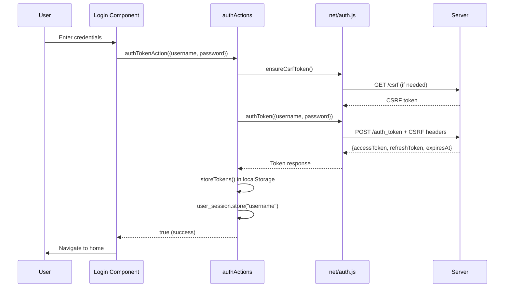
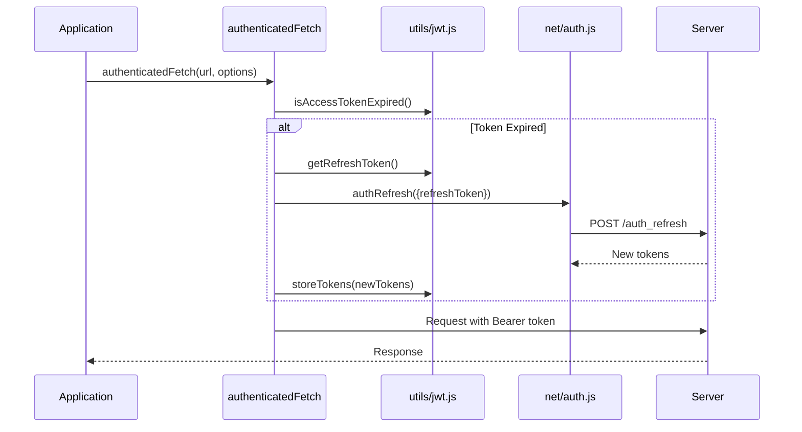
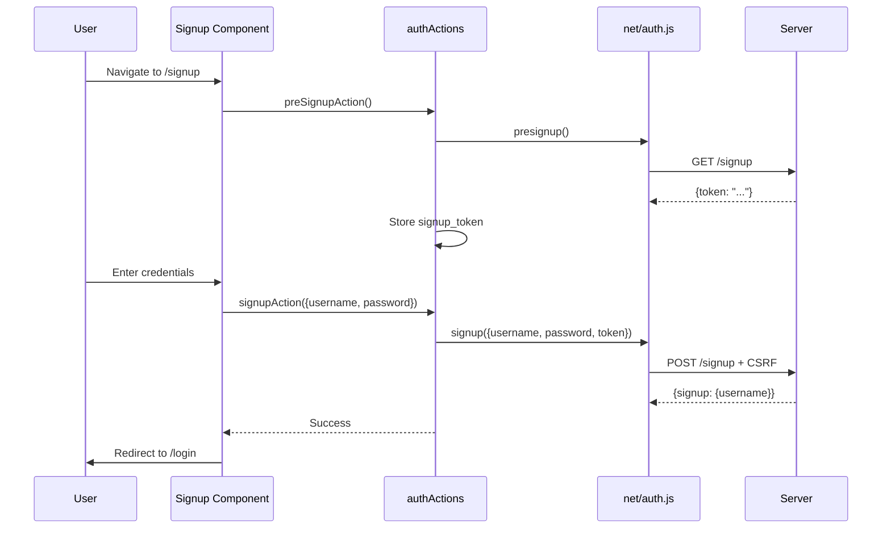
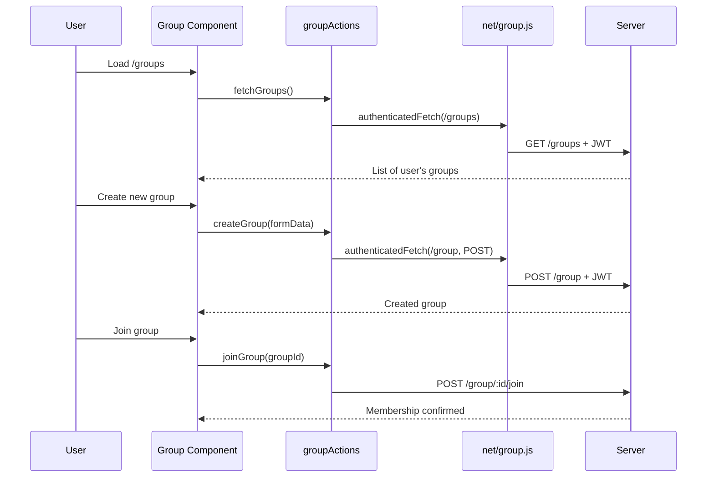
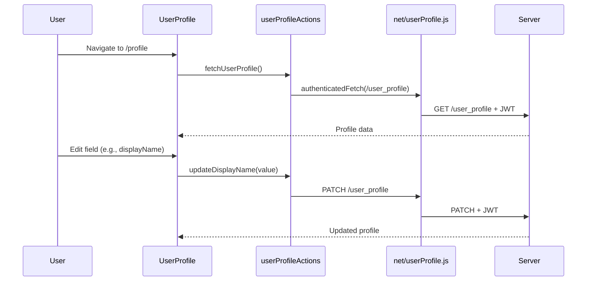
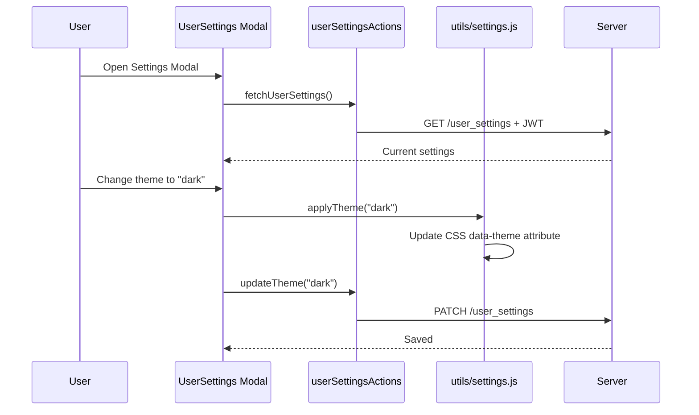
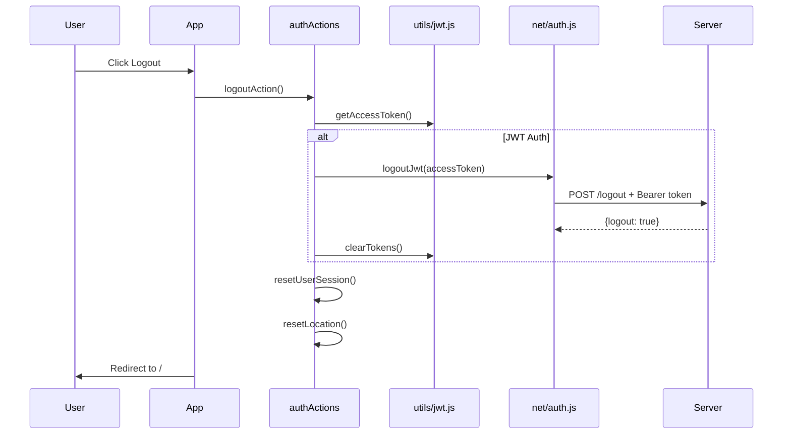

# MeetOnline React Client Application

A modern React-based client application for the MeetOnline platform. Built with Vite, React 19, and featuring JWT authentication, theme customization, and group management capabilities.

## Table of Contents

- [Quick Start](#quick-start)
- [Environment Configuration](#environment-configuration)
- [Project Structure](#project-structure)
- [Features](#features)
- [Architecture](#architecture)
- [Testing](#testing)
- [Docker](#docker)

---

## Quick Start

```bash
# Install dependencies
npm install

# Generate SSL certificates (required for HTTPS)
npm run build:certs

# Start development server
VITE_ENV_FILE=local.env npm run dev

# Run tests
npm test
```

---

## Environment Configuration

The application uses environment files loaded via the `VITE_ENV_FILE` environment variable.

### Environment Files

| File | Purpose |
|------|---------|
| `local.env` | Local development - connects to `https://localhost:9443` |
| `docker.env` | Docker deployment - connects to `https://server:9443` |
| `e2e.env` | End-to-end testing configuration |

### Environment Variables

| Variable | Description | Example |
|----------|-------------|---------|
| `VITE_API_URL` | Backend API server URL | `https://localhost:9443` |
| `VITE_APP_MODE` | Application mode | `production` |
| `VITE_ENV_FILE` | Environment file to load | `local.env` |
| `E2E_PORT` | E2E test server port | `5180` |

### Usage

```bash
# Development with local server
VITE_ENV_FILE=local.env npm run dev

# Development with Docker backend
VITE_ENV_FILE=docker.env npm run dev
```

---

## Project Structure

```
src/
├── actions/          # Business logic and API action dispatchers
├── components/       # Reusable UI components
├── context/          # React Context providers
├── features/         # Feature-specific page components
├── hooks/            # Custom React hooks
├── net/              # Network layer (API clients)
├── themes/           # CSS theme files
├── utils/            # Utility functions
├── App.jsx           # Root application component
├── main.jsx          # Application entry point
└── session.js        # Session storage management
```

### Directory Details

#### `actions/` - Business Logic Layer

Actions bridge UI components and the network layer, handling business logic and state transformations.

| File | Purpose |
|------|---------|
| `authActions.js` | Authentication actions: login, signup, logout, token refresh |
| `groupActions.js` | Group CRUD operations and membership management |
| `userAccountActions.js` | Account deletion and management |
| `userProfileActions.js` | Profile fields update (name, email, phone, etc.) |
| `userSettingsActions.js` | User preferences and settings updates |

---

#### `net/` - Network Layer

Low-level HTTP clients and network utilities that communicate with the backend API.

| File | Purpose |
|------|---------|
| `auth.js` | Auth API calls: `authToken`, `authRefresh`, `signup`, `logout` |
| `authenticatedFetch.js` | JWT-aware fetch wrapper with auto token refresh |
| `csrf.js` | CSRF token management and injection |
| `group.js` | Group API endpoints |
| `net-conf.js` | API configuration and URL constants |
| `userAccount.js` | User account API calls |
| `userProfile.js` | User profile API calls |
| `userSettings.js` | User settings API calls |

---

#### `hooks/` - Custom React Hooks

| File | Purpose |
|------|---------|
| `useNavigate.js` | Client-side navigation with custom routing events |
| `useRoute.js` | Route state subscription using `useSyncExternalStore` |
| `useSession.js` | Access session context for auth state |

---

#### `context/` - React Context

| File | Purpose |
|------|---------|
| `SessionContext.jsx` | Global session state (`hasSession`, `login`, `logout`) |

---

#### `features/` - Page Components

| Component | Route | Description |
|-----------|-------|-------------|
| `Login.jsx` | `/login` | User authentication form |
| `Signup.jsx` | `/signup` | New user registration |
| `Logout.jsx` | `/logout` | Session termination |
| `Group.jsx` | `/groups` | Group management (CRUD, join, leave, search) |
| `UserProfile.jsx` | `/profile` | Editable user profile fields |
| `UserSettings.jsx` | Modal | Theme, font, notification preferences |
| `UserAccount.jsx` | `/account` | Account management |
| `Content.jsx` | - | Route-based content switcher |
| `Menu.jsx` | - | Navigation menu |

---

#### `components/` - Reusable UI Components

| Component | Purpose |
|-----------|---------|
| `EditableValue.jsx` | Inline-editable text field |
| `Error.jsx` | Service error display component |
| `Link.jsx` | Client-side navigation link |
| `Welcome.jsx` | Welcome message component |

---

#### `utils/` - Utility Functions

| File | Purpose |
|------|---------|
| `jwt.js` | JWT token storage, parsing, and validation |
| `cookie.js` | Cookie read/write utilities |
| `storage.js` | localStorage wrapper with namespacing |
| `session.js` | Session validation helpers |
| `settings.js` | Theme and font application utilities |
| `date.js` | Date formatting utilities |
| `string.js` | String manipulation helpers |

---

#### `themes/` - CSS Themes

Available themes: `light`, `dark`, `high-contrast-light`, `high-contrast-dark`, `teal`, `pink`, `red`, `sepia`, `gray`, and `system` (follows OS preference).

---

## Features

### 1. JWT Authentication

Secure token-based authentication with automatic refresh.



### 2. Token Refresh Flow



### 3. User Signup



### 4. Group Management



### 5. User Profile



### 6. User Settings



### 7. Logout Flow



---

## Architecture

### Data Flow

```
┌─────────────────────────────────────────────────────────────────┐
│                         React Components                         │
│  (features/, components/)                                        │
└──────────────────────────────┬──────────────────────────────────┘
                               │ User Events
                               ▼
┌─────────────────────────────────────────────────────────────────┐
│                         Actions Layer                            │
│  (actions/)                                                      │
│  - Business logic                                                │
│  - State transformations                                         │
│  - Token management                                              │
└──────────────────────────────┬──────────────────────────────────┘
                               │ API Calls
                               ▼
┌─────────────────────────────────────────────────────────────────┐
│                         Network Layer                            │
│  (net/)                                                          │
│  - authenticatedFetch with JWT                                   │
│  - CSRF token injection                                          │
│  - HTTP request/response handling                                │
└──────────────────────────────┬──────────────────────────────────┘
                               │ HTTPS
                               ▼
┌─────────────────────────────────────────────────────────────────┐
│                         Backend Server                           │
│  (Node.js Express @ VITE_API_URL)                               │
└─────────────────────────────────────────────────────────────────┘
```

### State Management

| Store | Technology | Purpose |
|-------|------------|---------|
| Session Context | React Context | Global auth state (`hasSession`) |
| Local Storage | `utils/storage.js` | JWT tokens, user preferences |
| URL State | Custom routing events | Current route path |

---

## Testing

### Unit Tests (Vitest)

```bash
# Run tests
npm test

# Watch mode with UI
npm run test:ui

# Coverage report
npm run test:coverage
```

### End-to-End Tests (Playwright)

```bash
# Local E2E tests
npm run e2e

# Docker-based E2E tests
npm run e2e:docker
```

---

## Docker

### Dockerfiles

| File | Purpose |
|------|---------|
| `Dockerfile` | Production build |
| `manual.Dockerfile` | Development with hot reload |
| `e2e.Dockerfile` | E2E testing environment |
| `e2e-base.Dockerfile` | Base image for E2E tests |

### Building and Running

```bash
# Build production image
docker build -t meetonline-client .

# Run with Docker Compose (recommended)
# See root docker-compose.yml
```

---

## NPM Scripts

| Script | Description |
|--------|-------------|
| `dev` | Start Vite dev server |
| `dev:e2e` | Start dev server on E2E port (5180) |
| `build` | Production build |
| `lint` | Run ESLint |
| `lint:fix` | Auto-fix lint issues |
| `test` | Run Vitest tests |
| `test:ui` | Vitest with UI |
| `test:coverage` | Generate coverage report |
| `e2e` | Run Playwright E2E tests |
| `e2e:docker` | Run E2E tests in container mode |
| `build:certs` | Generate SSL certificates |

---

## Configuration Files

| File | Purpose |
|------|---------|
| `vite.config.js` | Vite bundler configuration + test setup |
| `vitest.config.js` | Vitest test runner configuration |
| `playwright.config.js` | Playwright E2E test configuration |
| `eslint.config.js` | ESLint rules and plugins |
