# MeetOnline Architecture - PlantUML Diagrams

PlantUML source code for architecture diagrams. Render these using PlantUML tools or IDE plugins.

---

## System Overview

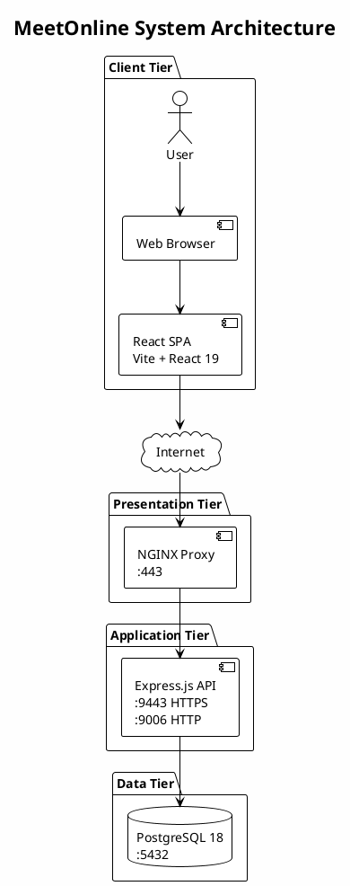

---

## Component Diagram

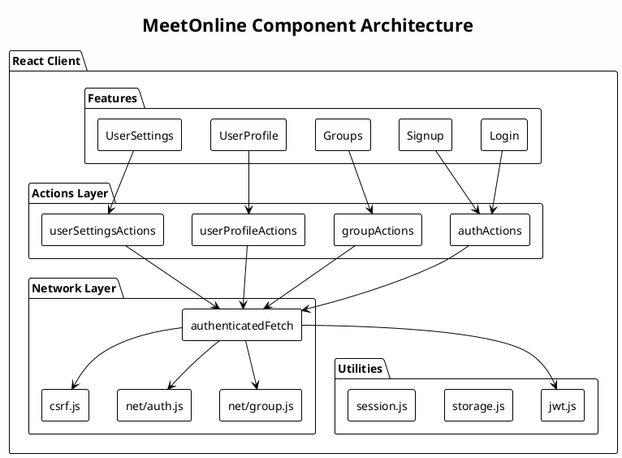

---

## Server Component Diagram

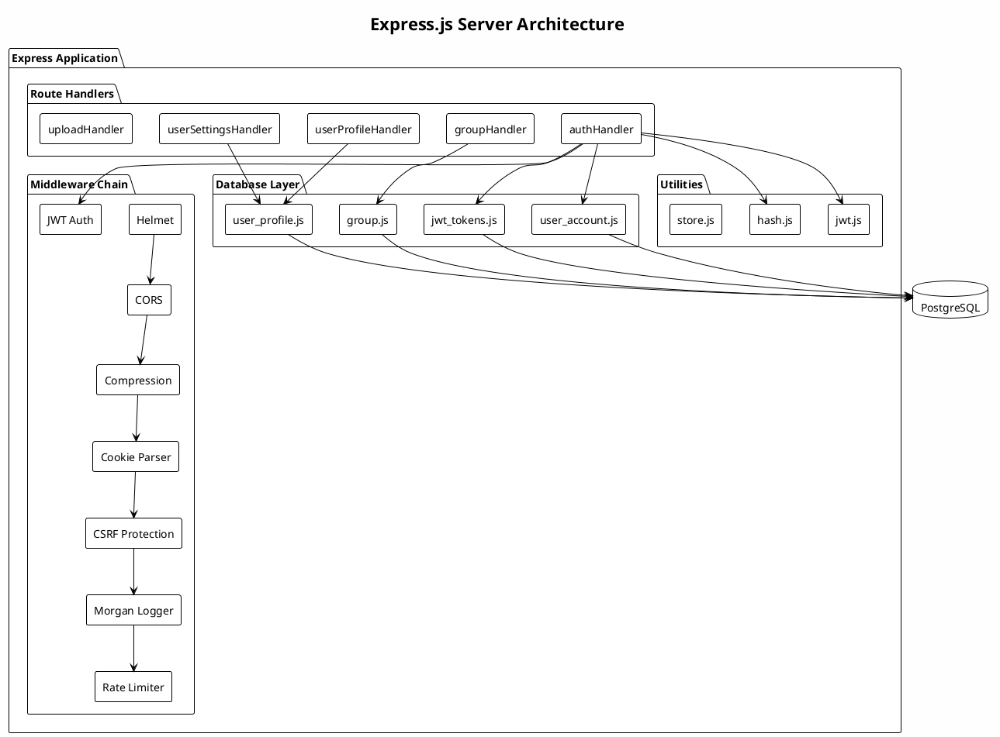

---

## Entity Relationship Diagram

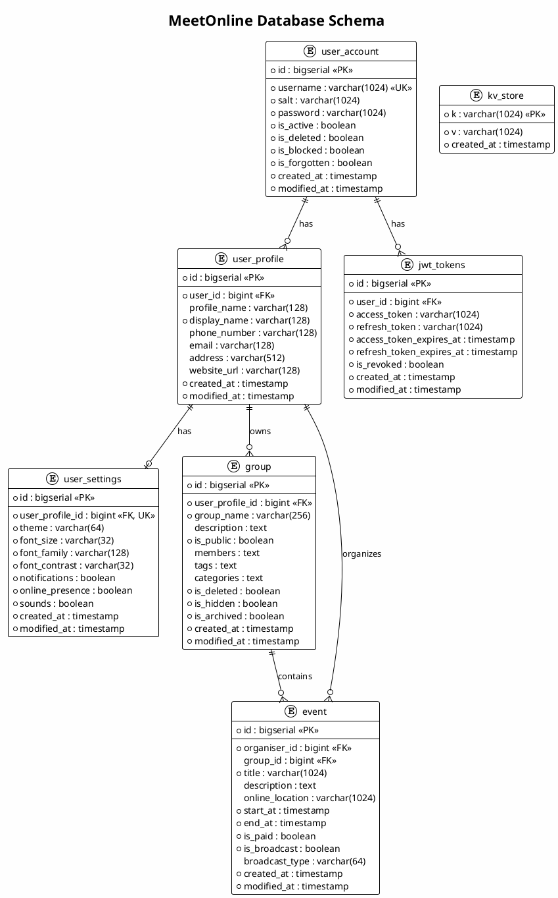

---

## JWT Authentication Sequence

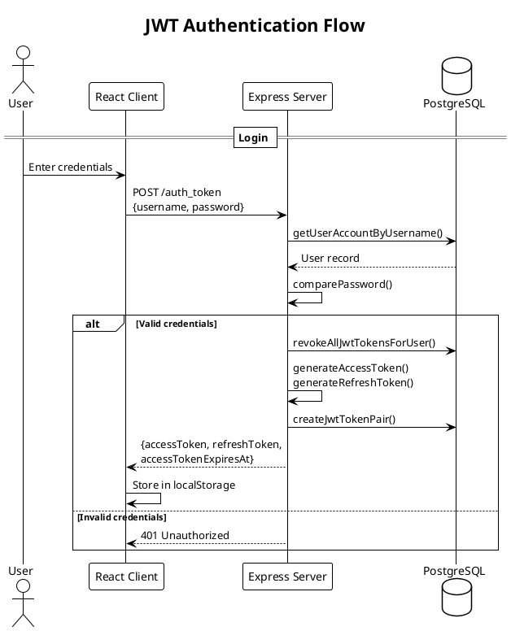

---

## Token Refresh Sequence

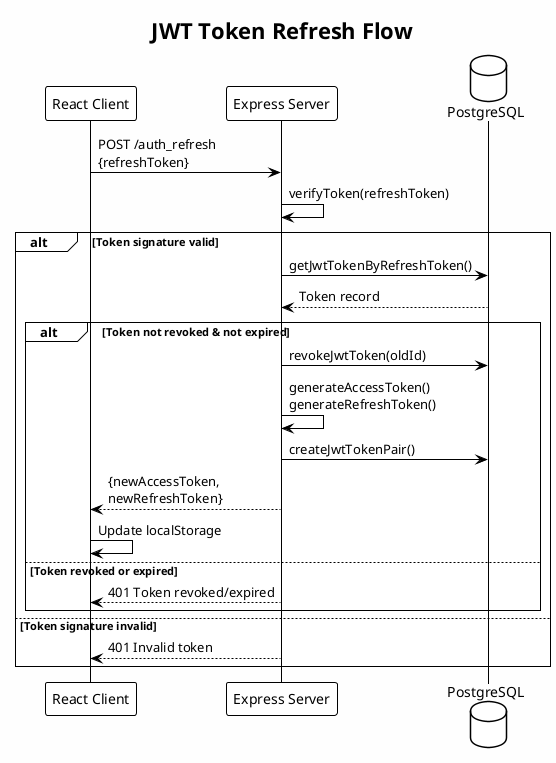

---

## Authenticated Request Sequence

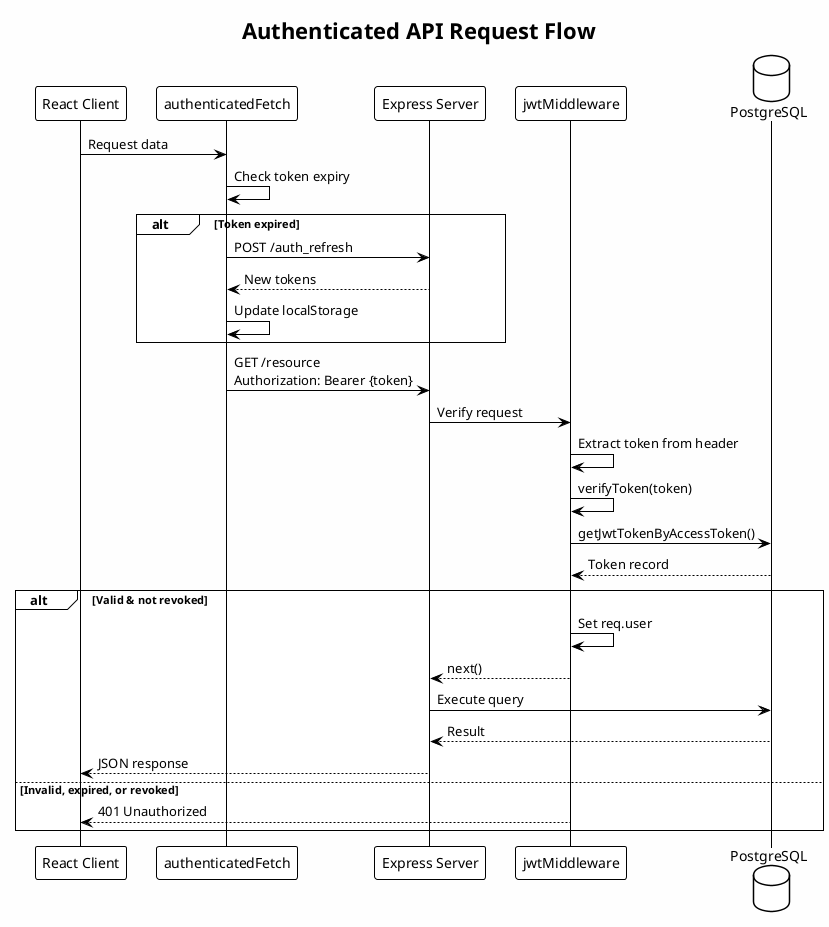

---

## User Signup Sequence

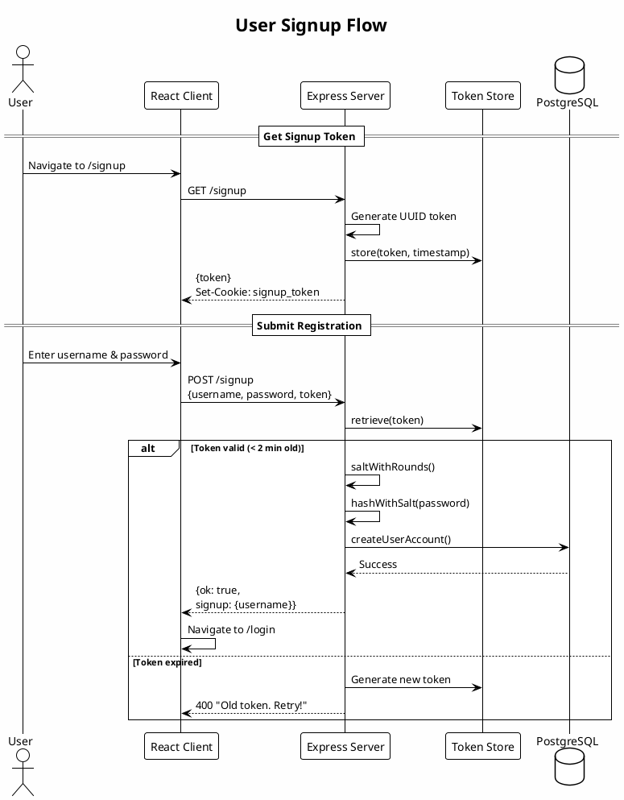

---

## Deployment Diagram

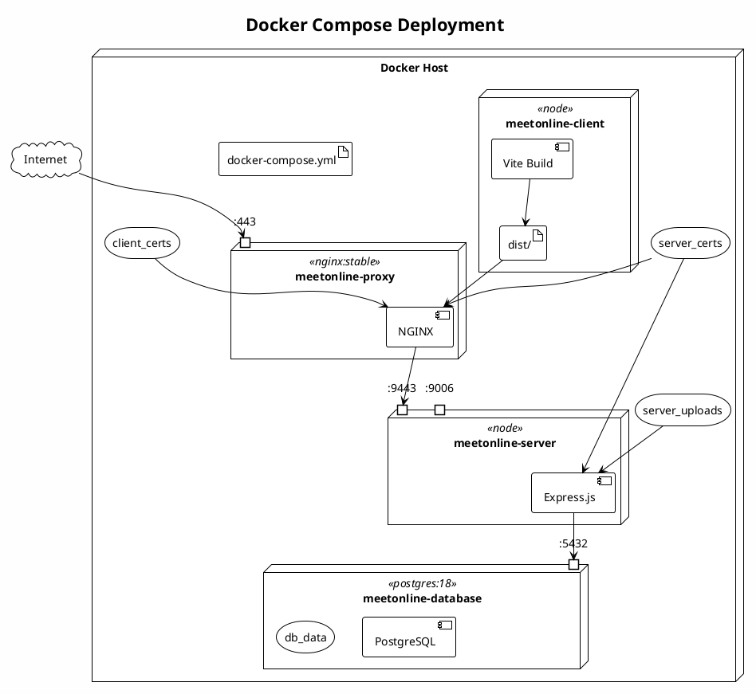

---

## Security Layers

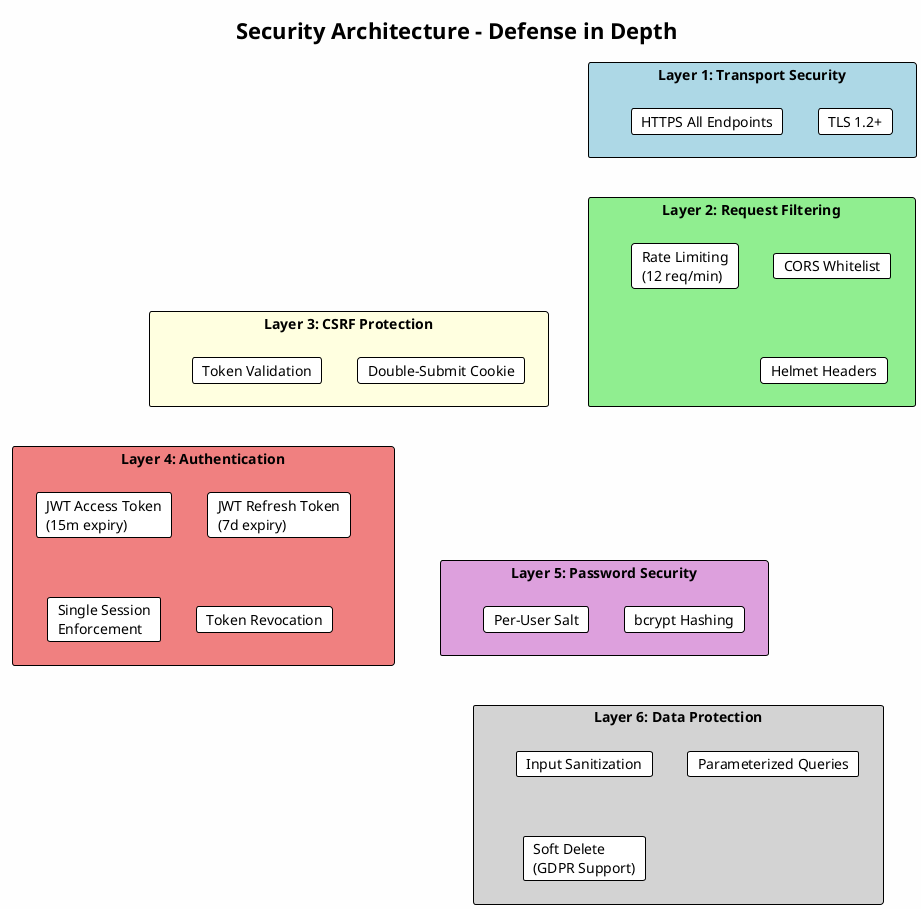

---

## Group Management Sequence

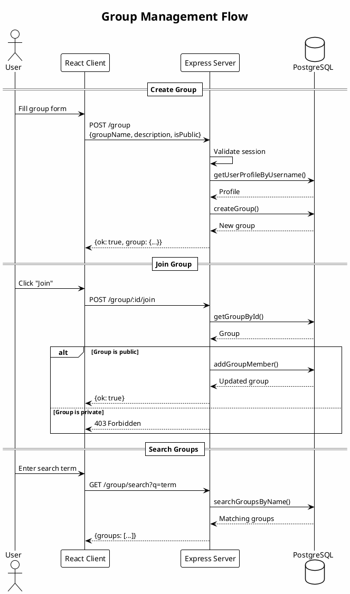

---

## Rendering Instructions

### Using PlantUML CLI

```bash
# Install PlantUML
brew install plantuml  # macOS
apt install plantuml   # Debian/Ubuntu

# Render single diagram
plantuml -tsvg docs/arch.puml.md

# Render all diagrams to PNG
plantuml -tpng docs/arch.puml.md
```

### Using VS Code

1. Install "PlantUML" extension
2. Open this file
3. Alt+D to preview diagrams

### Using IntelliJ IDEA

1. Install "PlantUML Integration" plugin
2. Open this file
3. Click the PlantUML diagram icon

### Online Renderer

Paste code blocks into [PlantUML Web Server](https://www.plantuml.com/plantuml/uml/)
