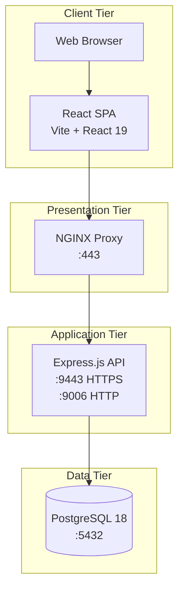
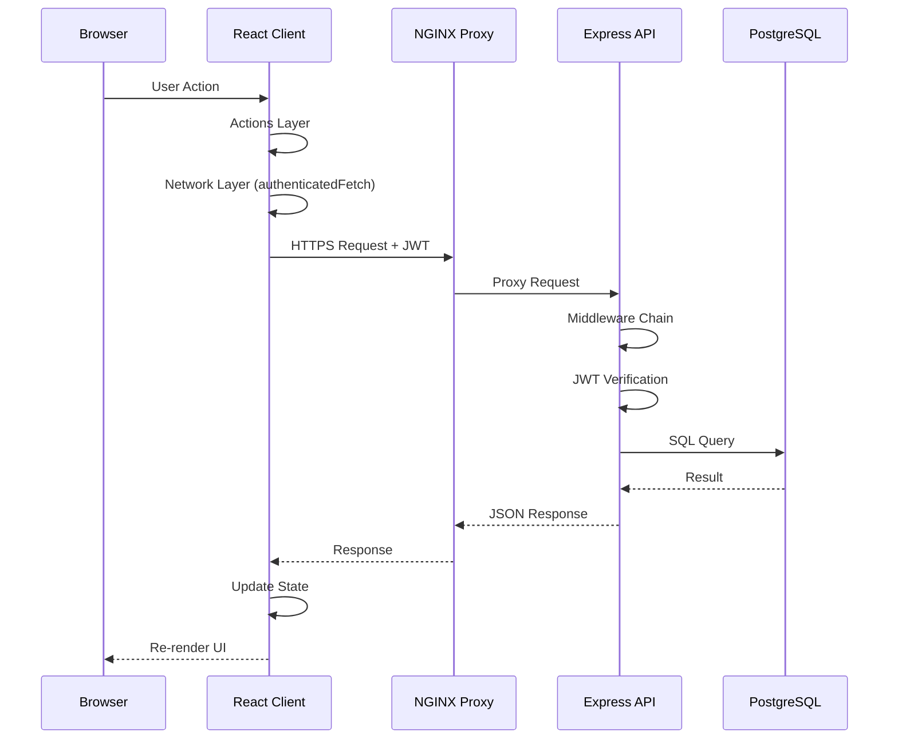
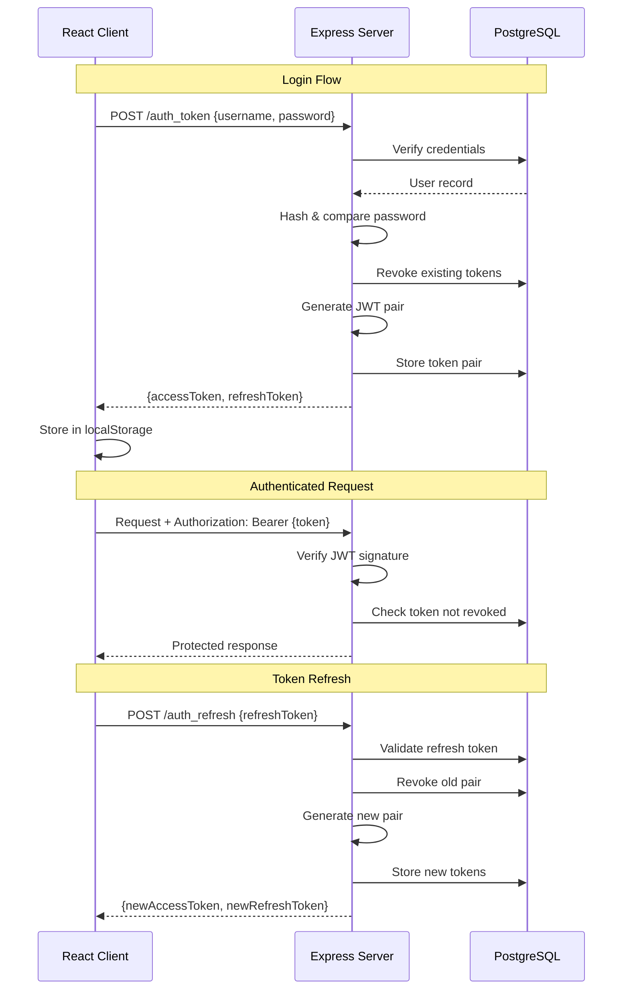
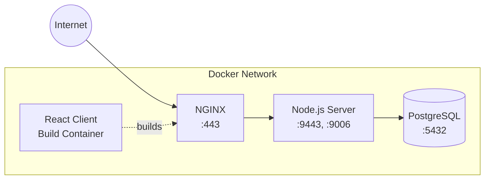

# MeetOnline Architecture

High-level architecture overview of the MeetOnline platform, a web application for organizing and managing online meetings and events.

## Table of Contents

- [System Overview](#system-overview)
- [Technology Stack](#technology-stack)
- [Component Architecture](#component-architecture)
- [Data Flow](#data-flow)
- [Authentication Flow](#authentication-flow)
- [Deployment Architecture](#deployment-architecture)
- [Security Architecture](#security-architecture)
- [Component Documentation](#component-documentation)

---

## System Overview

MeetOnline is a three-tier web application consisting of:

1. **React Client** - Single-page application for user interface
2. **Node.js Server** - RESTful API backend with Express.js
3. **PostgreSQL Database** - Persistent data storage



---

## Technology Stack

| Layer | Technology | Version | Purpose |
|-------|------------|---------|---------|
| **Frontend** | React | 19.x | UI components and state management |
| | Vite | 7.x | Build tool and dev server |
| | Playwright | 1.57 | E2E testing |
| | Vitest | 4.x | Unit testing |
| **Backend** | Node.js | 20+ | JavaScript runtime |
| | Express | 5.x | HTTP framework |
| | JWT | jsonwebtoken | Stateless authentication |
| | bcrypt | 6.x | Password hashing |
| | Helmet | 8.x | Security headers |
| **Database** | PostgreSQL | 18.x | Relational database |
| **Infrastructure** | Docker | - | Containerization |
| | Docker Compose | - | Multi-container orchestration |
| | NGINX | stable | Reverse proxy |

---

## Component Architecture

### React Client

```
┌─────────────────────────────────────────────────────────────────────┐
│                         React Application                            │
├─────────────────────────────────────────────────────────────────────┤
│  ┌─────────────┐  ┌─────────────┐  ┌─────────────┐  ┌────────────┐  │
│  │   Login     │  │   Signup    │  │   Groups    │  │  Settings  │  │
│  │   Feature   │  │   Feature   │  │   Feature   │  │   Modal    │  │
│  └──────┬──────┘  └──────┬──────┘  └──────┬──────┘  └─────┬──────┘  │
│         │                │                │               │          │
│         ▼                ▼                ▼               ▼          │
│  ┌───────────────────────────────────────────────────────────────┐  │
│  │                      Actions Layer                             │  │
│  │  authActions.js | groupActions.js | userSettingsActions.js    │  │
│  └────────────────────────────┬──────────────────────────────────┘  │
│                               │                                      │
│  ┌────────────────────────────▼──────────────────────────────────┐  │
│  │                      Network Layer                             │  │
│  │  net/auth.js | net/group.js | authenticatedFetch.js | csrf.js│  │
│  └────────────────────────────┬──────────────────────────────────┘  │
│                               │                                      │
│  ┌────────────────────────────▼──────────────────────────────────┐  │
│  │                      Utilities                                 │  │
│  │  jwt.js | storage.js | session.js | settings.js               │  │
│  └───────────────────────────────────────────────────────────────┘  │
└─────────────────────────────────────────────────────────────────────┘
```

### Node.js Server

```
┌─────────────────────────────────────────────────────────────────────┐
│                         Express Application                          │
├─────────────────────────────────────────────────────────────────────┤
│  ┌───────────────────────────────────────────────────────────────┐  │
│  │                    Middleware Chain                            │  │
│  │  Helmet → CORS → Compression → Cookie → CSRF → Morgan → Rate  │  │
│  └────────────────────────────┬──────────────────────────────────┘  │
│                               │                                      │
│  ┌────────────────────────────▼──────────────────────────────────┐  │
│  │                    Route Handlers                              │  │
│  │  authHandler | groupHandler | userProfileHandler | ...         │  │
│  └────────────────────────────┬──────────────────────────────────┘  │
│                               │                                      │
│  ┌────────────────────────────▼──────────────────────────────────┐  │
│  │                    Database Layer                              │  │
│  │  user_account.js | user_profile.js | group.js | jwt_tokens.js │  │
│  └────────────────────────────┬──────────────────────────────────┘  │
│                               │                                      │
│  ┌────────────────────────────▼──────────────────────────────────┐  │
│  │                    PostgreSQL (pg)                             │  │
│  └───────────────────────────────────────────────────────────────┘  │
└─────────────────────────────────────────────────────────────────────┘
```

### PostgreSQL Database

```
┌─────────────────────────────────────────────────────────────────────┐
│                         PostgreSQL 18                                │
├─────────────────────────────────────────────────────────────────────┤
│                                                                      │
│  ┌──────────────┐      ┌──────────────┐      ┌──────────────┐       │
│  │ user_account │──┬──▶│ user_profile │──┬──▶│user_settings │       │
│  └──────────────┘  │   └──────────────┘  │   └──────────────┘       │
│         │          │          │          │                           │
│         │          │          │          └──▶┌──────────────┐       │
│         │          │          └─────────────▶│    group     │       │
│         │          │                         └──────────────┘       │
│         │          │                                │                │
│         │          │                                ▼                │
│         │          │                         ┌──────────────┐       │
│         │          │                         │    event     │       │
│         │          │                         └──────────────┘       │
│         │          │                                                 │
│         │          └────────────────────────▶┌──────────────┐       │
│         └───────────────────────────────────▶│  jwt_tokens  │       │
│                                              └──────────────┘       │
│                                                                      │
│  ┌──────────────┐                                                    │
│  │   kv_store   │  (Standalone key-value storage)                   │
│  └──────────────┘                                                    │
│                                                                      │
└─────────────────────────────────────────────────────────────────────┘
```

---

## Data Flow

### Request Flow



---

## Authentication Flow

### JWT-Based Authentication



### Token Lifecycle

| Token Type | Expiry | Storage | Revocation |
|------------|--------|---------|------------|
| Access Token | 15 minutes | localStorage | On logout, refresh, new login |
| Refresh Token | 7 days | localStorage | On logout, use, new login |

---

## Deployment Architecture

### Docker Compose Services



### Container Configuration

| Service | Image | Ports | Dependencies |
|---------|-------|-------|--------------|
| `proxy` | `nginx:stable` | 443 | client, server |
| `client` | `meetonline-client` | - | server |
| `server` | `meetonline-server` | 9443, 9006 | database (healthy) |
| `database` | `meetonline-database` | 5432 | - |

### Volumes

| Volume | Purpose |
|--------|---------|
| `db_data` | PostgreSQL data persistence |
| `server_uploads` | User uploaded files |
| `server_certs` | TLS certificates |
| `server_tmp` | Temporary files |
| `client_certs` | Client TLS certificates |

---

## Security Architecture

### Defense in Depth

```
┌─────────────────────────────────────────────────────────────────────┐
│                        Security Layers                               │
├─────────────────────────────────────────────────────────────────────┤
│                                                                      │
│  ┌─────────────────────────────────────────────────────────────┐    │
│  │  Layer 1: Transport Security                                │    │
│  │  • TLS 1.2+ (HTTPS on all endpoints)                       │    │
│  │  • Self-signed certificates for development                 │    │
│  └─────────────────────────────────────────────────────────────┘    │
│                                                                      │
│  ┌─────────────────────────────────────────────────────────────┐    │
│  │  Layer 2: Request Filtering                                 │    │
│  │  • CORS whitelist (ALLOWED_ORIGINS)                        │    │
│  │  • Rate limiting (12 req/min on auth endpoints)            │    │
│  │  • Helmet security headers                                  │    │
│  └─────────────────────────────────────────────────────────────┘    │
│                                                                      │
│  ┌─────────────────────────────────────────────────────────────┐    │
│  │  Layer 3: CSRF Protection                                   │    │
│  │  • Double-submit cookie pattern                             │    │
│  │  • Token validation on state-changing requests              │    │
│  └─────────────────────────────────────────────────────────────┘    │
│                                                                      │
│  ┌─────────────────────────────────────────────────────────────┐    │
│  │  Layer 4: Authentication                                    │    │
│  │  • JWT access tokens (15m expiry)                          │    │
│  │  • JWT refresh tokens (7d expiry)                          │    │
│  │  • Single session enforcement                               │    │
│  │  • Database-backed token revocation                         │    │
│  └─────────────────────────────────────────────────────────────┘    │
│                                                                      │
│  ┌─────────────────────────────────────────────────────────────┐    │
│  │  Layer 5: Password Security                                 │    │
│  │  • bcrypt hashing with configurable rounds                 │    │
│  │  • Per-user salt storage                                    │    │
│  └─────────────────────────────────────────────────────────────┘    │
│                                                                      │
│  ┌─────────────────────────────────────────────────────────────┐    │
│  │  Layer 6: Data Protection                                   │    │
│  │  • Input sanitization                                       │    │
│  │  • Parameterized SQL queries                                │    │
│  │  • Soft delete with GDPR support (is_forgotten flag)       │    │
│  └─────────────────────────────────────────────────────────────┘    │
│                                                                      │
└─────────────────────────────────────────────────────────────────────┘
```

### Security Summary

| Threat | Mitigation |
|--------|------------|
| Man-in-the-Middle | TLS encryption on all endpoints |
| Brute Force | Rate limiting (12 req/min) |
| CSRF | Double-submit cookie tokens |
| XSS | Helmet security headers, CSP |
| Session Hijacking | Short-lived tokens, single session |
| SQL Injection | Parameterized queries (pg) |
| Credential Theft | bcrypt password hashing |

---

## Component Documentation

| Component | README |
|-----------|--------|
| React Client | [client/react-client-app/README.md](../client/react-client-app/README.md) |
| Node.js Server | [server/node-server-app/README.md](../server/node-server-app/README.md) |
| PostgreSQL Database | [database/README.md](../database/README.md) |

---

## API Endpoints Summary

### Authentication

| Method | Endpoint | Description |
|--------|----------|-------------|
| `GET` | `/csrf-token` | Get CSRF token |
| `GET` | `/signup` | Get signup token |
| `POST` | `/signup` | Create account |
| `POST` | `/auth_token` | Login (get JWT) |
| `POST` | `/auth_refresh` | Refresh JWT |
| `POST` | `/logout` | Terminate session |

### User Management

| Method | Endpoint | Description |
|--------|----------|-------------|
| `GET` | `/user_profile` | Get profile |
| `PATCH` | `/user_profile` | Update profile |
| `GET` | `/user_settings` | Get settings |
| `PATCH` | `/user_settings` | Update settings |
| `DELETE` | `/user_account` | Delete account |

### Groups

| Method | Endpoint | Description |
|--------|----------|-------------|
| `POST` | `/group` | Create group |
| `GET` | `/groups` | List groups |
| `GET` | `/group/:id` | Get group |
| `PATCH` | `/group/:id` | Update group |
| `DELETE` | `/group/:id` | Delete group |
| `POST` | `/group/:id/join` | Join group |
| `POST` | `/group/:id/leave` | Leave group |
| `GET` | `/group/search?q=` | Search groups |

---

## Quick Reference

### Development Commands

```bash
# Start all services
docker compose up

# Client development
cd client/react-client-app
VITE_ENV_FILE=local.env npm run dev

# Server development
cd server/node-server-app
npm run dev

# Run tests
npm test                    # Server unit tests
npm run e2e                 # Client E2E tests
```

### Environment Setup

See individual component READMEs for detailed environment configuration:
- [Client Environment](../client/react-client-app/README.md#environment-configuration)
- [Server Environment](../server/node-server-app/README.md#environment-configuration)
- [Database Environment](../database/README.md#environment-configuration)
