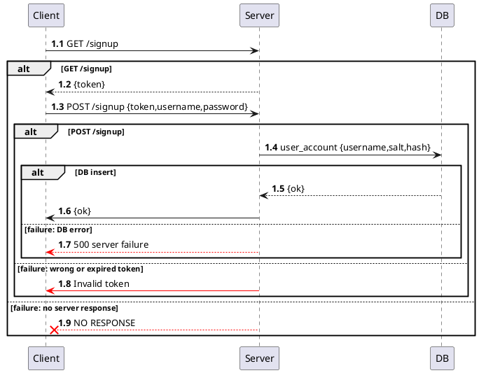
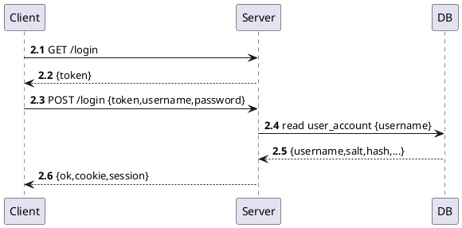
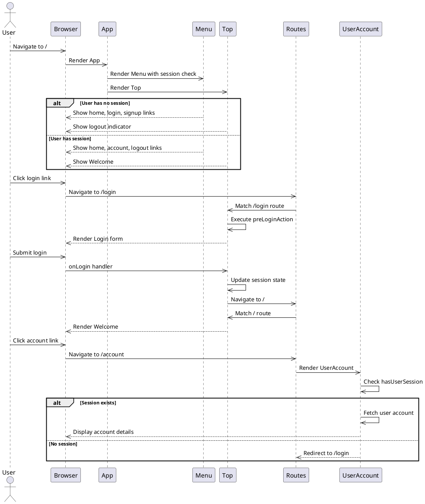

# Authentication Architecture

Signup

```plantuml
@startuml

autonumber 1.1
Client -> Server: GET /signup

alt GET /signup

    Server --> Client: {token}
    Client -> Server: POST /signup {token,username,password}

    alt POST /signup
        Server -> DB: user_account {username,salt,hash}
        alt DB insert
            DB --> Server: {ok}
            Server -> Client: {ok}
        else failure: DB error
            Server -[#red]-> Client: 500 server failure
        end
            
    else failure: wrong or expired token
        Server -[#red]> Client: Invalid token
    end
else failure: no server response

    Server -[#red]->x Client: NO RESPONSE

end
@enduml
```

Login

```plantuml
@startuml


autonumber 2.1
Client -> Server: GET /login
Server --> Client: {token}

Client -> Server: POST /login {token,username,password}
Server -> DB: read user_account {username}
DB --> Server: {username,salt,hash,...}
Server --> Client: {ok,cookie,session}

@enduml

```

As per #186

```plantuml
@startuml
actor User
participant Browser
participant App
participant Menu
participant Top
participant Routes
participant UserAccount

User ->> Browser: Navigate to /
Browser ->> App: Render App
App ->> Menu: Render Menu with session check
App ->> Top: Render Top

alt User has no session
    Menu -->> Browser: Show home, login, signup links
    Top -->> Browser: Show logout indicator
else User has session
    Menu -->> Browser: Show home, account, logout links
    Top -->> Browser: Show Welcome
end

User ->> Browser: Click login link
Browser ->> Routes: Navigate to /login
Routes ->> Top: Match /login route
Top ->> Top: Execute preLoginAction
Top -->> Browser: Render Login form

User ->> Browser: Submit login
Browser ->> Top: onLogin handler
Top ->> Top: Update session state
Top ->> Routes: Navigate to /
Routes ->> Top: Match / route
Top -->> Browser: Render Welcome

User ->> Browser: Click account link
Browser ->> Routes: Navigate to /account
Routes ->> UserAccount: Render UserAccount
UserAccount ->> UserAccount: Check hasUserSession

alt Session exists
    UserAccount ->> UserAccount: Fetch user account
    UserAccount -->> Browser: Display account details
else No session
    UserAccount -->> Routes: Redirect to /login
end
@enduml
```
