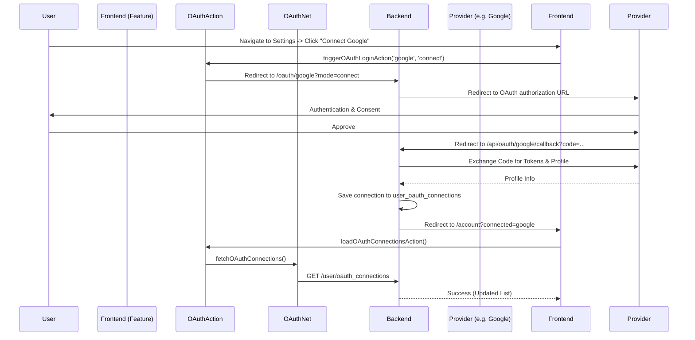
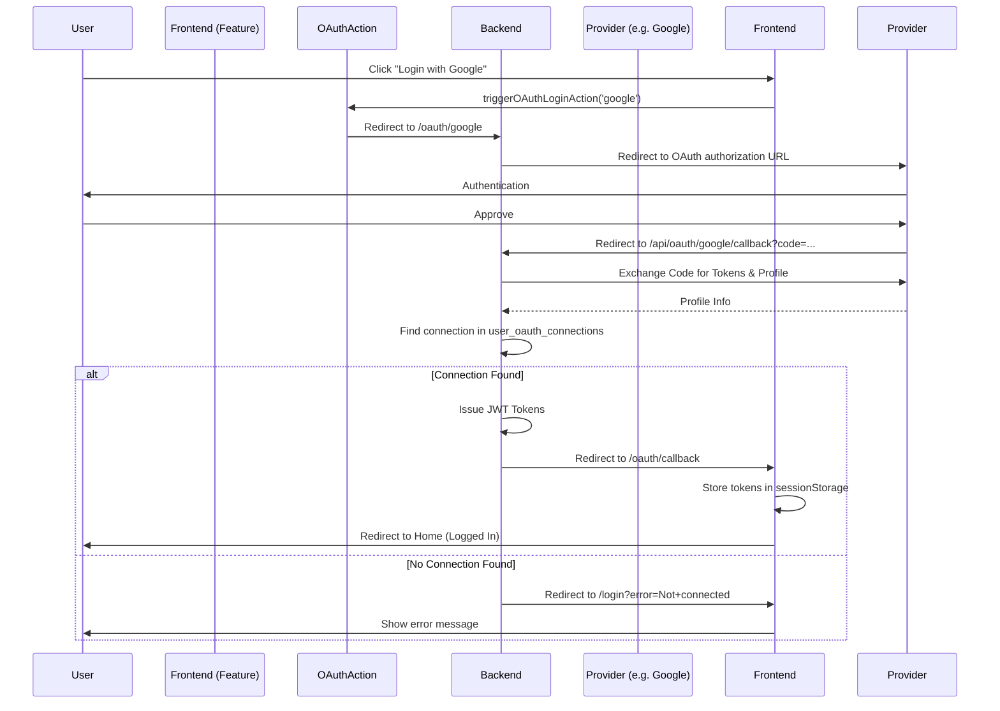

# Social Authentication (OAuth)

This document describes the implementation of social authentication for MeetOnline, including Google, Microsoft, Facebook, and Apple integrations.

## Strategy: Connect-First

MeetOnline implements a **Connect-First** strategy for social logins. 

- **No Social Signup**: Users cannot create an account directly using a social provider.
- **Account Creation**: Users must first sign up using a traditional username and password.
- **Connection**: Once logged in, users can navigate to **Account Settings** to "Connect" their social accounts.
- **Social Login**: After a social account is connected, the user can use that provider to log in to their existing account in future sessions.

## Architecture

### Database Schema

The `user_oauth_connections` table stores the link between a local user account and an external OAuth provider.

```sql
create table if not exists user_oauth_connections
(
    id           bigserial primary key,
    user_id      bigint                              not null,
    provider     varchar(64)                         not null, -- 'google', 'microsoft', 'apple', 'facebook'
    provider_id  varchar(1024)                       not null,
    email        varchar(256),
    profile_data text,                                         -- store raw profile as JSON string
    created_at   timestamp default CURRENT_TIMESTAMP not null,
    modified_at  timestamp default CURRENT_TIMESTAMP not null,
    constraint user_oauth_connections_user_id_fk foreign key (user_id) references user_account (id) on delete cascade,
    unique (provider, provider_id)
);
```

### Components

| Component | Responsibility |
|-----------|----------------|
| `passport.js` | Configures PassportJS strategies (Google, Microsoft, Facebook, Apple). |
| `oauthHandler.js` | Handles provider-specific initiation (`/api/oauth/{provider}`) and callback routes. |
| `userOAuthHandler.js`| Manages user-specific operations: listing connections and disconnecting. |
| `authUtils.js` | Centralized utility for issuing JWT token pairs after successful authentication. |
| `net/oauth.js` | Raw network fetch functions for OAuth endpoints. |
| `actions/oauthActions.js`| Application logic and redirect triggers for OAuth. |
| `SocialLoginButtons.jsx`| Frontend component displaying social login/connect options. |
| `OAuthCallback.jsx` | Frontend page (feature) that handles the redirect from the backend. |
| `ConnectedAccounts.jsx`| Frontend management feature for social connections. |

## Authentication Flows

### 1. Connection Flow (Logged In)



### 2. Login Flow (Logged Out)



## Configuration & Domain Migration

The social login implementation required migrating the application to a real domain to support OAuth redirect restrictions and secure cookie handling.

- **Domain**: `meet.online`
- **Frontend URL**: `https://meet.online`
- **Backend URL**: `https://meet.online:9443`
- **Cookie Domain**: `meet.online` (Allows subdomains and cross-service auth)

### Environment Variables

Required on the server:
```env
GOOGLE_CLIENT_ID=...
GOOGLE_CLIENT_SECRET=...
MICROSOFT_CLIENT_ID=...
MICROSOFT_CLIENT_SECRET=...
FACEBOOK_APP_ID=...
FACEBOOK_APP_SECRET=...
APPLE_CLIENT_ID=...
APPLE_TEAM_ID=...
APPLE_KEY_ID=...
APPLE_PRIVATE_KEY_PATH=...
BACKEND_URL=https://meet.online:9443
FRONTEND_URL=https://meet.online
```

## Security Considerations

1. **CSRF Exemptions**: OAuth initiation and callback routes are exempt from standard CSRF protection as they involve external redirects and lack initial session tokens.
2. **JWT in URL Fragment**: When redirecting from the backend to the frontend after a successful login, JWT tokens are passed in the **URL fragment** (`#`), ensuring they are not sent to the server in subsequent requests and are unavailable to search history in some browsers.
3. **Connect-First**: Prevents "account shadowing" and ensures all social accounts are explicitly linked to an authenticated MeetOnline user.

## Local Development Setup

To test social authentication locally:

1. Update `/etc/hosts`:
   ```text
   127.0.0.1 meet.online
   ```
2. Regenerate SSL certificates for the new domain:
   ```bash
   # In server/node-server-app and client/react-client-app
   npm run build:certs
   ```
3. Use a browser to access `https://meet.online` (bypassing certificate warnings if needed).
