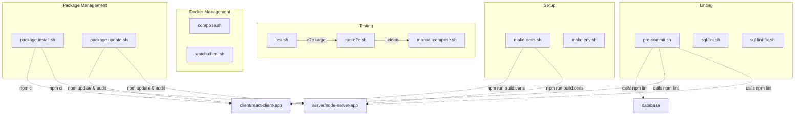

# Scripts

This directory contains utility scripts for the **meetonline** project.

## Script Overview

| Script | Description |
|--------|-------------|
| `changeset.sh` | Generate a ChangeSet markdown file comparing current branch to main |
| `compose.sh` | Rebuild and start all Docker services using docker-compose |
| `make.certs.sh` | Generate SSL certificates for both server and client |
| `make.env.sh` | Copy template env files to create `.env` files |
| `manual-compose.sh` | Manual Docker container management (build/run/clean) |
| `package.install.sh` | Clean install dependencies (`npm ci`) for server and client |
| `package.update.sh` | Update and audit npm packages for server and client |
| `pre-commit.sh` | Run all linters before committing |
| `run-e2e.sh` | Run end-to-end tests in Docker |
| `sql-lint.sh` | Lint SQL files using sqlfluff in Docker |
| `sql-lint-fix.sh` | Auto-fix SQL lint issues |
| `test.sh` | Unified test runner for all/server/client/e2e |
| `watch-client.sh` | Run Vite dev server with hot reload in Docker |

---

## Detailed Usage

### 🧪 Testing

```bash
# Run all tests
./scripts/test.sh all

# Run specific tests
./scripts/test.sh server    # Server unit tests
./scripts/test.sh client    # Client unit tests  
./scripts/test.sh e2e       # End-to-end tests
```

### 🐳 Docker Management

```bash
# Standard docker-compose workflow
./scripts/compose.sh

# Manual container management (recommended for development)
./scripts/manual-compose.sh --all      # Clean + Build + Run
./scripts/manual-compose.sh --clean    # Stop and remove containers
./scripts/manual-compose.sh --build    # Build images only
./scripts/manual-compose.sh --run      # Run containers only
./scripts/manual-compose.sh --no-db    # Skip database
./scripts/manual-compose.sh --no-server
./scripts/manual-compose.sh --no-client

# Development with hot reload (recommended for development)
./scripts/watch-client.sh
```

### 📦 Package Management

```bash
# Clean install (npm ci)
./scripts/package.install.sh

# Update and audit packages
./scripts/package.update.sh
```

### 🔧 Setup

```bash
# Generate SSL certificates
./scripts/make.certs.sh

# Create .env files from templates
./scripts/make.env.sh
```

### 🔍 Linting

```bash
# Run all linters (pre-commit hook)
./scripts/pre-commit.sh

# SQL linting
./scripts/sql-lint.sh      # Check only
./scripts/sql-lint-fix.sh  # Auto-fix
```

---

## Script Dependencies



---

## Exit Codes

All scripts follow standard exit codes:
- `0` - Success
- `1` - Failure (general error)
- `130` - Interrupted (CTRL+C)
