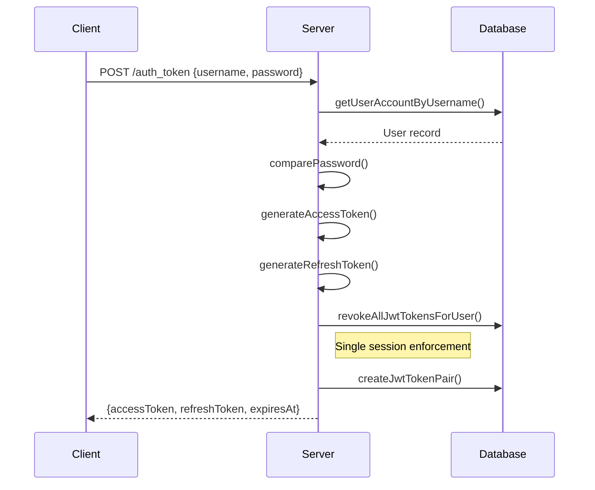
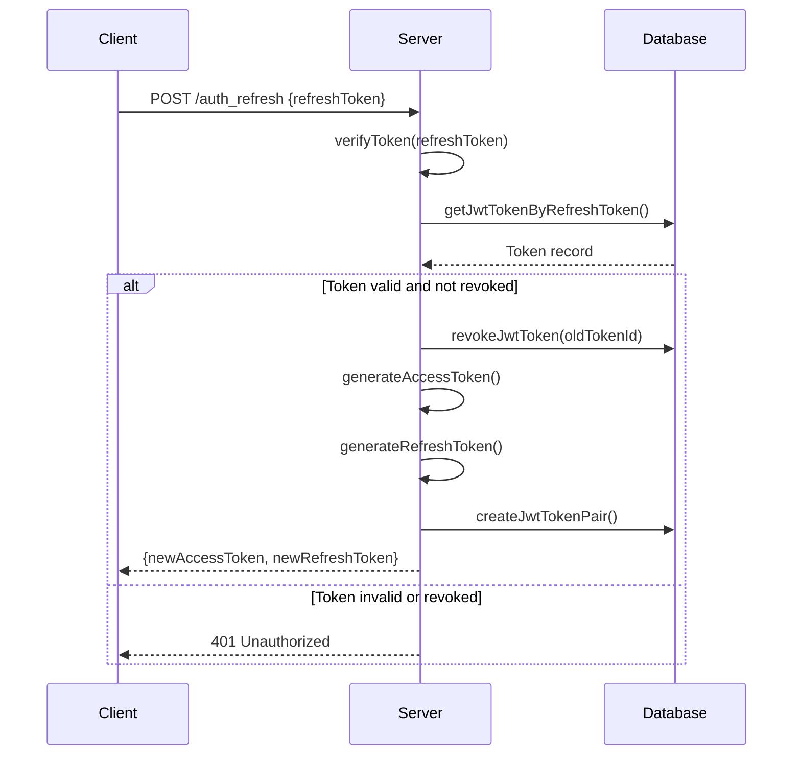
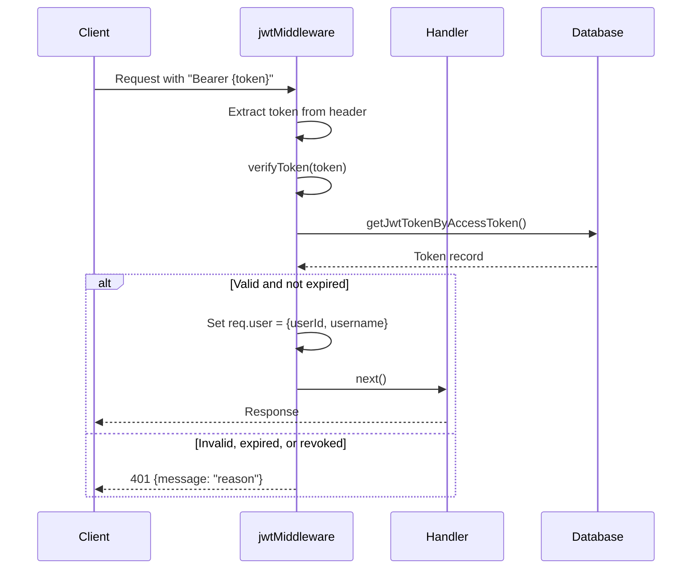
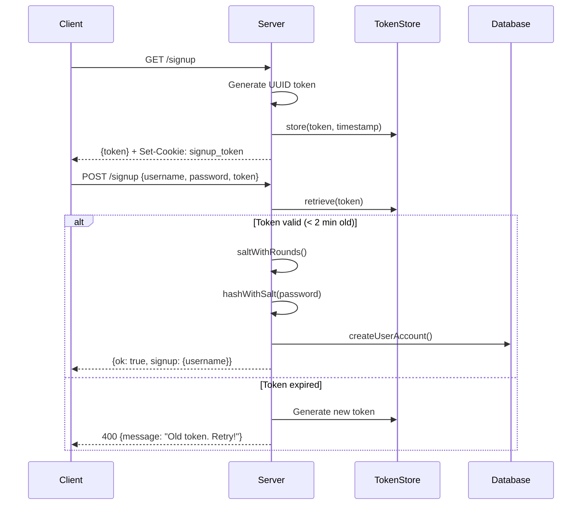
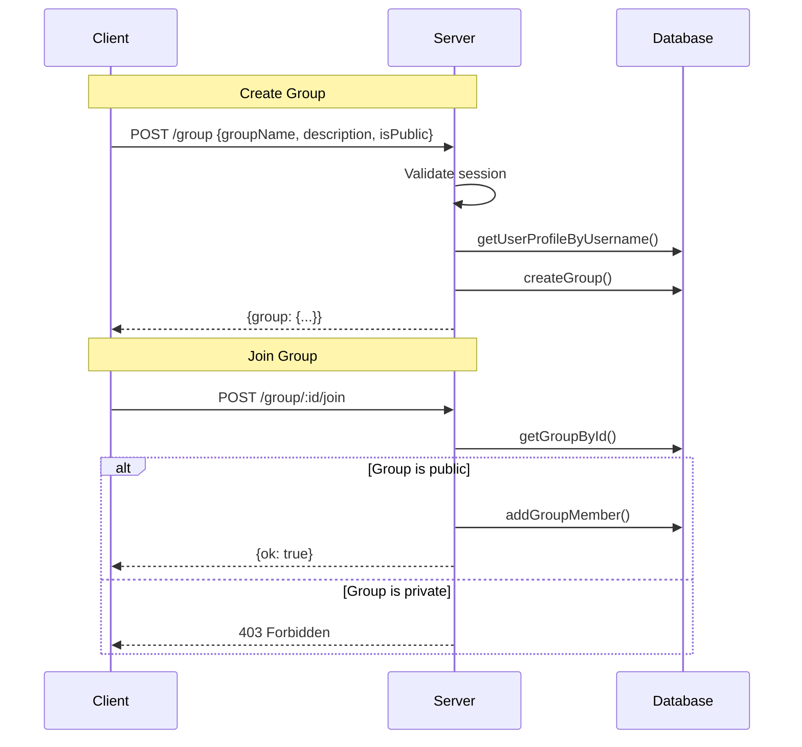
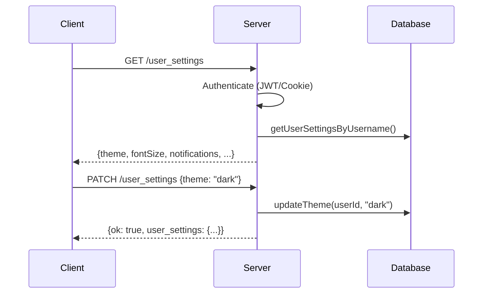
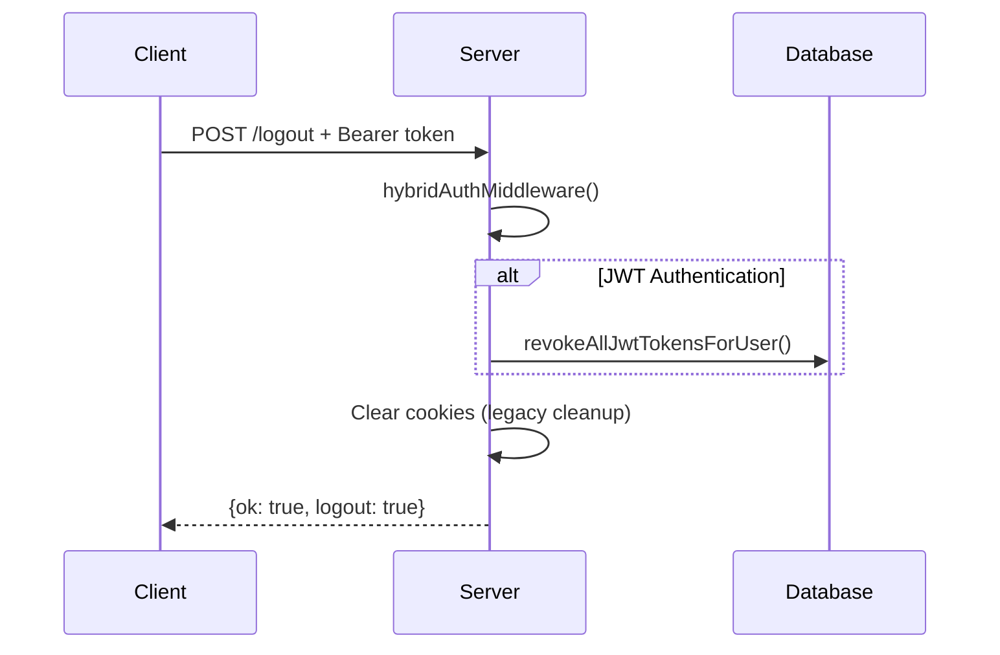

# MeetOnline Node.js Server

A secure Express.js backend API server for the MeetOnline platform. Features JWT authentication, PostgreSQL database, CSRF protection, rate limiting, and comprehensive user/group management.

## Table of Contents

- [Quick Start](#quick-start)
- [Environment Configuration](#environment-configuration)
- [Project Structure](#project-structure)
- [API Endpoints](#api-endpoints)
- [Features](#features)
- [Architecture](#architecture)
- [Testing](#testing)
- [Docker](#docker)

---

## Quick Start

```bash
# Install dependencies
npm install

# Generate SSL certificates
npm run build:certs

# Start development server
npm run dev

# Run tests
npm test
```

---

## Environment Configuration

### Environment Files

| File | Purpose |
|------|---------|
| `local.env` | Local development configuration |
| `docker.env` | Docker deployment configuration |

### Environment Variables

| Variable | Description | Example |
|----------|-------------|---------|
| `DB_USER` | PostgreSQL username | `myuser` |
| `DB_PASSWORD` | PostgreSQL password | `mypassword` |
| `DB_NAME` | Database name | `meetonline` |
| `DB_PORT` | PostgreSQL port | `5432` |
| `DB_HOST` | Database host | `localhost` |
| `SERVER_HTTP_PORT` | HTTP server port | `9006` |
| `SERVER_HTTPS_PORT` | HTTPS server port | `9443` |
| `ALLOWED_ORIGINS` | CORS allowed origins (comma-separated) | `https://localhost:5173` |
| `JWT_SECRET` | Secret key for JWT signing | Base64-encoded secret |
| `JWT_ACCESS_TOKEN_EXPIRY` | Access token expiration | `15m` |
| `JWT_REFRESH_TOKEN_EXPIRY` | Refresh token expiration | `7d` |

---

## Project Structure

```
src/
├── database/         # Database queries and connection
├── handlers/         # Express route handlers
├── middlewares/      # Express middleware
├── models/           # Data models
├── utils/            # Utility functions
└── server.js         # Application entry point
```

### Directory Details

#### `handlers/` - Route Handlers

Each handler sets up routes for a specific domain and implements the business logic.

| File | Routes | Purpose |
|------|--------|---------|
| `authHandler.js` | `/signup`, `/auth_token`, `/auth_refresh`, `/logout` | Authentication and session management |
| `groupHandler.js` | `/group`, `/groups`, `/group/:id`, `/group/:id/join`, `/group/:id/leave`, `/group/search` | Group CRUD and membership |
| `userAccountHandler.js` | `/user_account` | Account management and deletion |
| `userProfileHandler.js` | `/user_profile` | User profile CRUD |
| `userSettingsHandler.js` | `/user_settings` | User preferences and settings |
| `uploadHandler.js` | `/upload` | File upload handling |
| `rootHandler.js` | `/` | Health check and root routes |

---

#### `middlewares/` - Request Processing

| File | Purpose |
|------|---------|
| `jwtMiddleware.js` | JWT token verification and `req.user` population |
| `hybridAuthMiddleware.js` | Combined JWT + cookie session support |
| `csrfMiddleware.js` | CSRF token generation and validation |
| `corsMiddleware.js` | CORS configuration based on `ALLOWED_ORIGINS` |
| `uploadMiddleware.js` | Multer file upload configuration |

---

#### `database/` - Data Access Layer

| File | Purpose |
|------|---------|
| `db.js` | PostgreSQL connection pool and initialization |
| `user_account.js` | User account CRUD operations |
| `user_profile.js` | User profile CRUD operations |
| `user_settings.js` | User settings CRUD operations |
| `group.js` | Group CRUD and membership operations |
| `jwt_tokens.js` | JWT token storage, retrieval, and revocation |
| `event.js` | Event data operations |
| `kv_store.js` | Key-value store for tokens and sessions |

---

#### `models/` - Data Models

| File | Model | Description |
|------|-------|-------------|
| `userAccountModel.js` | `UserAccountModel` | User Account with status flags |
| `userProfileModel.js` | `UserProfileModel` | Profile with displayName, email, etc. |
| `userSettingsModel.js` | `UserSettingsModel` | Theme, font, notification preferences |
| `groupModel.js` | `GroupModel` | Group with members, tags, categories |
| `jwtTokenModel.js` | `JwtTokenModel` | JWT token pair storage |
| `eventModel.js` | `EventModel` | Event data structure |
| `kvstoreModel.js` | `KvStoreModel` | Generic key-value store |

---

#### `utils/` - Utility Functions

| File | Purpose |
|------|---------|
| `jwt.js` | JWT generation, verification, expiration handling |
| `hash.js` | Password hashing with bcrypt |
| `store.js` | In-memory stores for auth and token data |
| `env.js` | Environment variable loader |
| `sanitize.js` | Input sanitization utilities |
| `cookieConfig.js` | Cookie configuration constants |
| `gracefulSetup.js` | Graceful shutdown handling |
| `projectRoot.js` | Project root path resolution |
| `fs.js` | File system utilities |
| `date.js` / `dateUtils.js` | Date formatting |
| `session.js` | Session utilities |

---

## API Endpoints

### Authentication

| Method | Endpoint | Auth | Description |
|--------|----------|------|-------------|
| `GET` | `/signup` | None | Get signup token |
| `POST` | `/signup` | CSRF | Create new user account |
| `POST` | `/auth_token` | None | JWT-based login |
| `POST` | `/auth_refresh` | None | Refresh access token |
| `POST` | `/logout` | JWT/Cookie | Terminate session |
| `GET` | `/csrf-token` | None | Get CSRF token |

### User Management

| Method | Endpoint | Auth | Description |
|--------|----------|------|-------------|
| `GET` | `/user_profile` | JWT/Cookie | Get current user profile |
| `PATCH` | `/user_profile` | JWT/Cookie | Update profile fields |
| `GET` | `/user_settings` | JWT/Cookie | Get user settings |
| `PATCH` | `/user_settings` | JWT/Cookie | Update settings |
| `DELETE` | `/user_account` | JWT/Cookie | Delete user account |

### Groups

| Method | Endpoint | Auth | Description |
|--------|----------|------|-------------|
| `POST` | `/group` | Cookie | Create a new group |
| `GET` | `/groups` | Cookie | List user's groups |
| `GET` | `/group/:id` | Cookie | Get group details |
| `PATCH` | `/group/:id` | Cookie | Update group |
| `DELETE` | `/group/:id` | Cookie | Delete group |
| `POST` | `/group/:id/join` | Cookie | Join a public group |
| `POST` | `/group/:id/leave` | Cookie | Leave a group |
| `GET` | `/group/search?q=` | Cookie | Search groups by name |

### Uploads

| Method | Endpoint | Auth | Description |
|--------|----------|------|-------------|
| `POST` | `/upload` | JWT/Cookie | Upload file |
| `GET` | `/uploads/*` | None | Static file serving |

---

## Features

### 1. JWT Authentication Flow



### 2. Token Refresh Flow



### 3. Request Authentication (JWT Middleware)



### 4. User Signup Flow



### 5. Group Management Flow



### 6. User Settings Flow



### 7. Logout Flow



---

## Architecture

### Security Middleware Chain

```
Request
   │
   ▼
┌──────────────────┐
│     Helmet       │  ─── Security headers, noSniff
└────────┬─────────┘
         │
   ▼
┌──────────────────┐
│      CORS        │  ─── Origin validation (ALLOWED_ORIGINS)
└────────┬─────────┘
         │
   ▼
┌──────────────────┐
│   Compression    │  ─── Response compression
└────────┬─────────┘
         │
   ▼
┌──────────────────┐
│  Cookie Parser   │  ─── Parse cookies for session/CSRF
└────────┬─────────┘
         │
   ▼
┌──────────────────┐
│      CSRF        │  ─── Token validation (exempt: auth routes)
└────────┬─────────┘
         │
   ▼
┌──────────────────┐
│     Morgan       │  ─── Request logging
└────────┬─────────┘
         │
   ▼
┌──────────────────┐
│  Rate Limiter    │  ─── Per-route rate limiting (auth: 12/min)
└────────┬─────────┘
         │
   ▼
┌──────────────────┐
│ JWT/Cookie Auth  │  ─── Route-level authentication
└────────┬─────────┘
         │
   ▼
   Handler
```

### Data Flow

```
┌─────────────────────────────────────────────────────────────────┐
│                         HTTP/HTTPS Request                       │
└──────────────────────────────┬──────────────────────────────────┘
                               │
                               ▼
┌─────────────────────────────────────────────────────────────────┐
│                     Middleware Chain (server.js)                 │
│  helmet → cors → compression → cookieParser → csrf → morgan      │
└──────────────────────────────┬──────────────────────────────────┘
                               │
                               ▼
┌─────────────────────────────────────────────────────────────────┐
│                         Route Handlers                           │
│  (handlers/)                                                     │
│  - Rate limiting                                                 │
│  - Authentication                                                │
│  - Business logic                                                │
└──────────────────────────────┬──────────────────────────────────┘
                               │
                               ▼
┌─────────────────────────────────────────────────────────────────┐
│                         Database Layer                           │
│  (database/)                                                     │
│  - PostgreSQL queries                                            │
│  - Model instantiation                                           │
└──────────────────────────────┬──────────────────────────────────┘
                               │
                               ▼
┌─────────────────────────────────────────────────────────────────┐
│                      PostgreSQL Database                         │
└─────────────────────────────────────────────────────────────────┘
```

### Authentication Modes

| Mode | Header/Cookie | Use Case |
|------|---------------|----------|
| JWT | `Authorization: Bearer <token>` | Primary auth for API calls |
| Cookie | `session-1`, `username` cookies | Legacy/fallback support |
| Hybrid | Both supported | Transitional compatibility |

---

## Testing

### Running Tests

```bash
# Run all tests
npm test

# Run tests in watch mode
npm run test:jest:watch

# Generate coverage report
npm run cover
```

### Test Structure

```
tests-jest/
├── handlers/           # Handler unit tests
├── middlewares/        # Middleware tests
├── utils/              # Utility function tests
└── ...
```

---

## Docker

### Dockerfiles

| File | Purpose |
|------|---------|
| `Dockerfile` | Production build |
| `manual.Dockerfile` | Development with hot reload |

### Building

```bash
# Build production image
docker build -t meetonline-server .

# Run with Docker Compose (recommended)
# See root docker-compose.yml
```

### Directory Mounts

| Directory | Purpose |
|-----------|---------|
| `certs/` | SSL certificates (`server.key`, `server.crt`) |
| `uploads/` | User uploaded files |
| `tmp/` | Temporary files |

---

## NPM Scripts

| Script | Description |
|--------|-------------|
| `start` | Production server |
| `dev` | Development server with hot reload |
| `dev:certs` | Build certs then start dev server |
| `build` | Create required directories |
| `build:certs` | Generate SSL certificates |
| `test` | Run test suite |
| `test:jest:watch` | Tests in watch mode |
| `cover` | Generate coverage report |
| `lint` | Run ESLint |
| `lint:fix` | Auto-fix lint issues |

---

## Security Features

| Feature | Implementation |
|---------|----------------|
| **HTTPS** | TLS 1.2+ with self-signed certificates |
| **Helmet** | Security headers (CSP, HSTS, noSniff, etc.) |
| **CORS** | Whitelist-based origin validation |
| **CSRF** | Double-submit cookie pattern via `csrf-csrf` |
| **Rate Limiting** | `express-rate-limit` (12 req/min on auth routes) |
| **Password Hashing** | bcrypt with configurable rounds |
| **JWT** | Access tokens (15m) + Refresh tokens (7d) |
| **Single Session** | Previous tokens revoked on new login |
| **Token Revocation** | Database-backed token blacklist |
